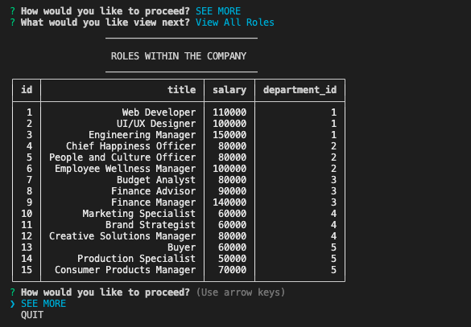

# Staff Management System

## Table of Contents
* [Description](#description)
* [Link](#link)
* [Installation](#installation)
* [Usage](#usage)
* [Author](#author)
* [License](#license)

## Description
* The Staff Management System is a command-line application that is used to manage a company's employee database. Details about the [installation]() required are listed below.
When the application is [run](#usage) the user is presented with a plethora of options that allow them to view tables directly in the console or make changes to the tables that have been created. 

## Demo

<br />

:movie_camera: [Click here to view a video that will walk you through the applications functionality.](https://drive.google.com/file/d/17jjWfC7OnDIhObflbNgBPvOBqtaAkdur/view)


## Link
* Link to the [Staff Management System Repo](https://github.com/lesliejpatino/Staff-Management-System)

## Installation
The following dependencies will be needed in order for this application to work:
* [Node.js](https://nodejs.org/en/)
* [Node module - Inquirer](https://www.npmjs.com/package/inquirer)
* [MySQL2](https://www.npmjs.com/package/mysql2)
* [Console-Table-Printer](https://www.npmjs.com/package/console-table-printer)

## Usage
Once the dependencies found under [Installation](#installation) are installed, the application can be run directly from the command line by typing:
```
node index.js
```

## Author
Leslie Patino
* [Leslie's GitHub](https://github.com/lesliejpatino)
* [Leslie's LinkedIn](https://www.linkedin.com/in/lesliejpatino/)


## License

<br />
Copyright 2022 Leslie Patino 

Permission is hereby granted, free of charge, to any person obtaining a copy of this software and associated documentation files (the "Software"), to deal in the Software without restriction, including without limitation the rights to use, copy, modify, merge, publish, distribute, sublicense, and/or sell copies of the Software, and to permit persons to whom the Software is furnished to do so, subject to the following conditions: The above copyright notice and this permission notice shall be included in all copies or substantial portions of the Software.
    
THE SOFTWARE IS PROVIDED "AS IS", WITHOUT WARRANTY OF ANY KIND, EXPRESS OR IMPLIED, INCLUDING BUT NOT LIMITED TO THE WARRANTIES OF MERCHANTABILITY, FITNESS FOR A PARTICULAR PURPOSE AND NONINFRINGEMENT. IN NO EVENT SHALL THE AUTHORS OR COPYRIGHT HOLDERS BE LIABLE FOR ANY CLAIM, DAMAGES OR OTHER LIABILITY, WHETHER IN AN ACTION OF CONTRACT, TORT OR OTHERWISE, ARISING FROM, OUT OF OR IN CONNECTION WITH THE SOFTWARE OR THE USE OR OTHER DEALINGS IN THE SOFTWARE. 